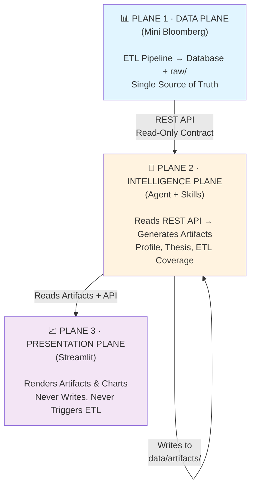
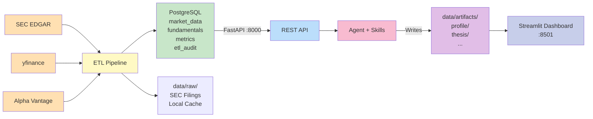

# Personal Financial Skills — Mini Bloomberg

A one-person AI-powered equity research platform built around three decoupled planes: a **Mini Bloomberg** data engine (Database + ETL), an **AI Agent** layer that generates analysis artifacts, and a **Streamlit** dashboard for review.

---

## Architecture



**Three hard boundaries:**
- Streamlit **never writes** — it only reads artifacts and calls the API
- The Agent **never touches the database directly** — it reads through the REST API
- ETL **never calls the Agent** — data ingestion is a separate, scheduled process

### Two-Server Topology (Target)

| Concern | Data Server | Agent Server |
|---------|-------------|--------------|
| PostgreSQL + pgAdmin | Docker | — |
| FastAPI (`:8000`) | Native | — |
| ETL Pipeline | Native | — |
| Prefect (`:4200`) | Native | — |
| Streamlit (`:8501`) | — | Service |
| Task Dispatcher | — | Service (polls REST API) |
| OpenClaw Agent | — | Installed |
| Artifact Git Repo | — | Separate `.git` |

> **Hard rule**: The Agent Server has **zero** database dependencies — all data access goes through the REST API.

For full design details see [`docs/architecture.md`](docs/architecture.md) and [`docs/migration-plan.md`](docs/migration-plan.md).

---

## Data Flow



**Data source priority**: `REST API (database) > local SEC files > Alpha Vantage > yfinance > web search`

---

## Project Structure

```
personal-financial-skills/
├── pfs/                           # Python package (Data Server)
│   ├── api/                       #   FastAPI app + routers
│   │   └── routers/               #     companies, financials, filings, etl,
│   │                              #     analysis (heavy compute), tasks (CRUD)
│   ├── db/                        #   SQLAlchemy models + session + schema
│   ├── etl/                       #   ETL pipeline + SEC/price/yfinance clients
│   ├── mcp/                       #   MCP server (kept but not run in production)
│   ├── analysis/                  #   Heavy compute (profile, valuation, report)
│   ├── tasks/                     #   Task queue models
│   ├── config.py                  #   App configuration
│   └── splits.py                  #   Stock split adjustments
│
├── skills/                        # Agent skills (Agent Server)
│   ├── _lib/                      #   Shared skill utilities (no pfs.* imports)
│   │   ├── thesis_io.py           #     Local JSON I/O for thesis artifacts
│   │   ├── artifact_io.py         #     Generic artifact read/write
│   │   ├── api_client.py          #     HTTP client for Data Server REST API
│   │   ├── task_client.py         #     HTTP client for task CRUD
│   │   └── mcp_helpers.py         #     Common MCP call patterns (legacy)
│   ├── company-profile/           #   Company tearsheet generation
│   ├── thesis-tracker/            #   Investment thesis CRUD + health checks
│   └── etl-coverage/              #   Data coverage auditing
│
├── dashboard/                     # Streamlit app (Agent Server)
│   ├── app.py                     #   Main entry point
│   ├── pages/                     #   Company Profile, Thesis Tracker, Agent Chat
│   └── components/                #   Tabs, loaders, styles, utils
│
├── agents/                        # Agent configurations
│   ├── task_dispatcher.py         #   Polls /api/tasks/next, dispatches to OpenClaw
│   ├── openclaw/                  #   Production agent persona + artifact gitignore
│   ├── copilot/                   #   GitHub Copilot agent config
│   └── prompts/                   #   Shared prompt templates (commit-on-write)
│
├── prefect/                       # Prefect flows (Data Server)
│   └── flows/                     #   price_sync, filing_check, data_validation
│
├── deploy/
│   ├── docker/                    #   docker-compose.data.yml (PostgreSQL + pgAdmin)
│   ├── systemd/                   #   pfs-streamlit, pfs-task-dispatcher
│   ├── postgres/                  #   PostgreSQL tuning config
│   └── scripts/                   #   setup-data-server, setup-agent-server,
│                                  #   setup-openclaw, deploy
│
├── data/
│   ├── raw/                       #   SEC filings (Data Server)
│   ├── artifacts/                 #   Agent output (Agent Server, git-tracked)
│   └── reports/                   #   Generated reports
│
├── tests/                         # pytest test suite
├── docs/                          # Architecture, API, quickstart, migration plan
└── scripts/                       # Utility scripts
```

---

## Skills

Each skill has a `SKILL.md` with instructions, a `config.yaml` for trigger definitions, and scripts for execution. Skills write to exactly one artifact path and never call each other directly.

| Skill | Output | Status |
|---|---|---|
| `company-profile` | `data/artifacts/{ticker}/profile/` | ✅ Ready |
| `thesis-tracker` | `data/artifacts/{ticker}/thesis/` | ✅ Ready |
| `etl-coverage` | `data/artifacts/_etl/` | ✅ Ready |

---

## Quick Start

```bash
# 1. Configure environment
cp .env.example .env              # set SEC_USER_AGENT to your email

# 2. Start PostgreSQL
docker compose -f deploy/docker/docker-compose.data.yml up -d

# 3. Install dependencies
uv sync

# 4. Ingest a company
uv run python -m pfs.etl.pipeline ingest NVDA --years 5

# 5. Start the API
uv run uvicorn pfs.api.app:app --reload
# → http://localhost:8000/docs

# 6. Start Streamlit
uv run streamlit run dashboard/app.py
# → http://localhost:8501
```

See [`docs/quickstart.md`](docs/quickstart.md) for the full guide.

---

## Key Commands

```bash
# ETL
uv run python -m pfs.etl.pipeline ingest {TICKER} --years 5
uv run python -m pfs.etl.pipeline sync-prices
uv run python -m pfs.etl.section_extractor {TICKER}

# Company profile
uv run python skills/company-profile/scripts/build_comps.py {TICKER}
uv run python skills/company-profile/scripts/generate_report.py {TICKER}

# Investment thesis (unified CLI)
uv run python skills/thesis-tracker/scripts/thesis_cli.py create  {TICKER} --interactive
uv run python skills/thesis-tracker/scripts/thesis_cli.py update  {TICKER} --interactive
uv run python skills/thesis-tracker/scripts/thesis_cli.py check   {TICKER}
uv run python skills/thesis-tracker/scripts/thesis_cli.py catalyst {TICKER} --add
uv run python skills/thesis-tracker/scripts/thesis_cli.py report  {TICKER}

# API
uv run uvicorn pfs.api.app:app --reload
# → http://localhost:8000/docs
```

---

## API Reference

See [`docs/api.md`](docs/api.md) for full documentation.

| Method | Path | Description |
|---|---|---|
| `GET` | `/health` | Health check |
| `GET` | `/api/companies/` | List all ingested companies |
| `GET` | `/api/companies/{ticker}` | Company details |
| `POST` | `/api/etl/ingest` | Trigger ETL for a ticker |
| `POST` | `/api/etl/sync-prices` | Sync daily prices |
| `GET` | `/api/etl/runs` | ETL run history |
| `GET` | `/api/filings/{ticker}` | List SEC filings |
| `GET` | `/api/filings/{ticker}/{id}/content` | Raw filing HTML |
| `GET` | `/api/financials/{ticker}/income-statements` | Income statements |
| `GET` | `/api/financials/{ticker}/balance-sheets` | Balance sheets |
| `GET` | `/api/financials/{ticker}/cash-flows` | Cash flow statements |
| `GET` | `/api/financials/{ticker}/metrics` | Computed metrics |
| `GET` | `/api/financials/{ticker}/prices` | Price history |
| `GET` | `/api/financials/{ticker}/segments` | Revenue segments |
| `GET` | `/api/analysis/profile/{ticker}` | Company profile data |
| `GET` | `/api/analysis/valuation/{ticker}` | DCF + sensitivity + comps |
| `GET` | `/api/analysis/coverage/{ticker}` | ETL coverage report |
| `GET` | `/api/analysis/current-price/{ticker}` | Current stock price |
| `GET` | `/api/tasks/` | List tasks |
| `GET` | `/api/tasks/schedule` | All recurring tasks |
| `GET` | `/api/tasks/next` | Next pending task (dispatcher) |
| `POST` | `/api/tasks/` | Create a task |

---

## Tech Stack

| Component | Technology |
|---|---|
| Database | PostgreSQL 16 (Docker) or SQLite |
| ETL | Python + httpx + SEC EDGAR XBRL API |
| Conflict resolution | Alpha Vantage API + yfinance |
| Backend API | FastAPI |
| Agent | Claude + Skills |
| Scheduling | Prefect |
| Dashboard | Streamlit + Plotly |
| Artifact versioning | Git (commit-on-write) |
| Package manager | uv |

---

## Documentation

| Doc | Contents |
|---|---|
| [`docs/architecture.md`](docs/architecture.md) | System design, three-plane decoupling, data flow |
| [`docs/quickstart.md`](docs/quickstart.md) | Setup and first ingest |
| [`docs/api.md`](docs/api.md) | API endpoint reference |
| [`docs/artifact-schema.md`](docs/artifact-schema.md) | JSON schema for each artifact type |
| [`docs/migration-plan.md`](docs/migration-plan.md) | Two-server migration plan + skill-platform boundary |
| [`docs/prefect-local-orchestration.md`](docs/prefect-local-orchestration.md) | Local Prefect orchestration guide |

---

## License

Apache-2.0