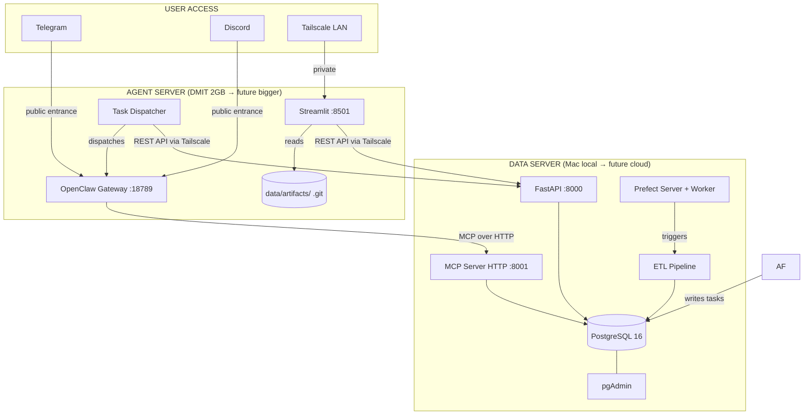
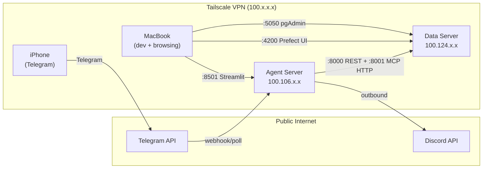
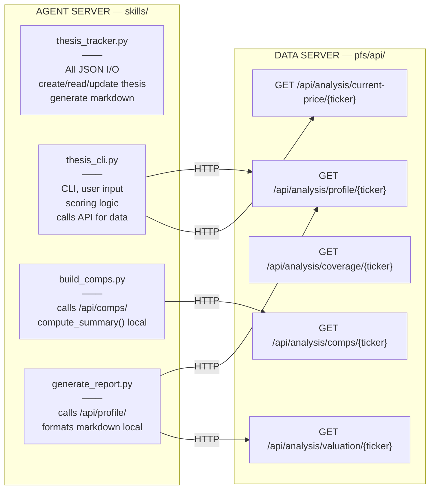
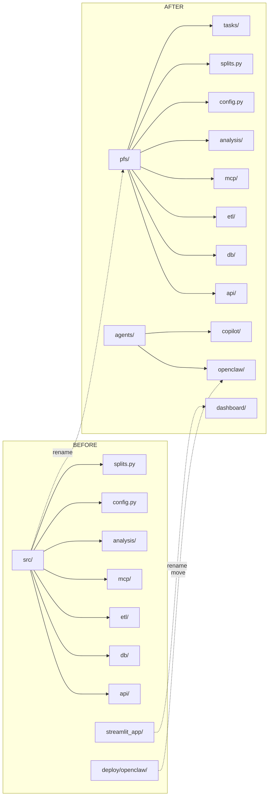
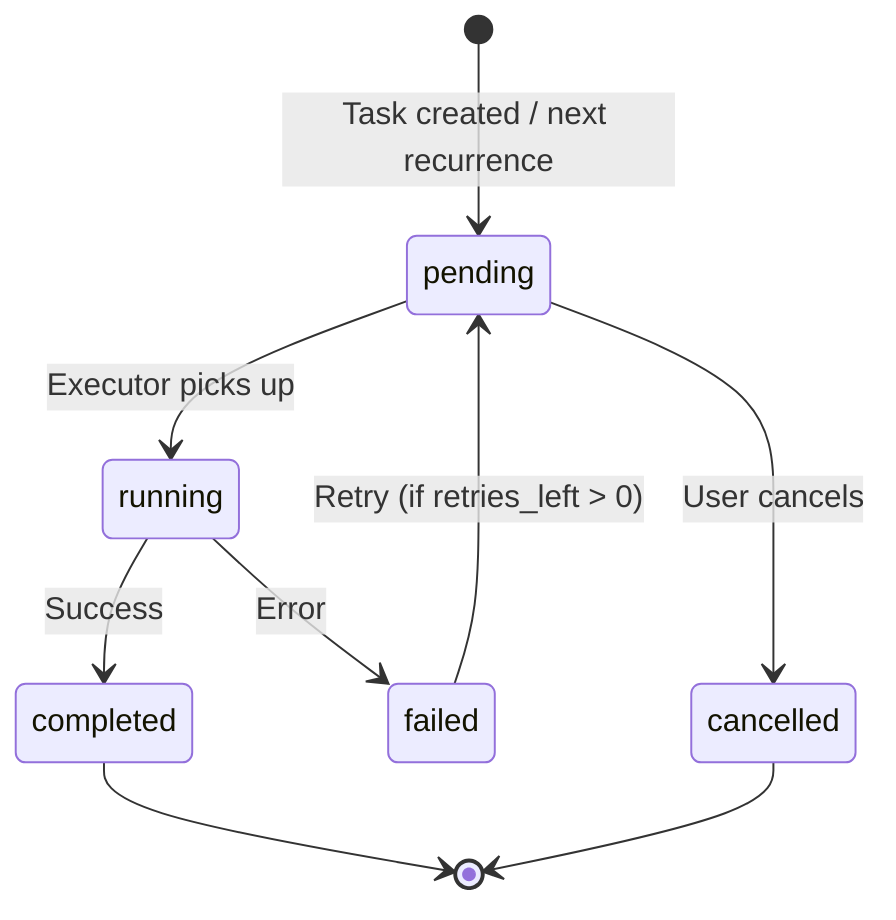
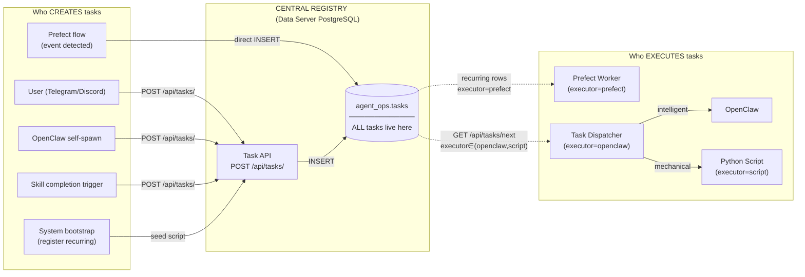
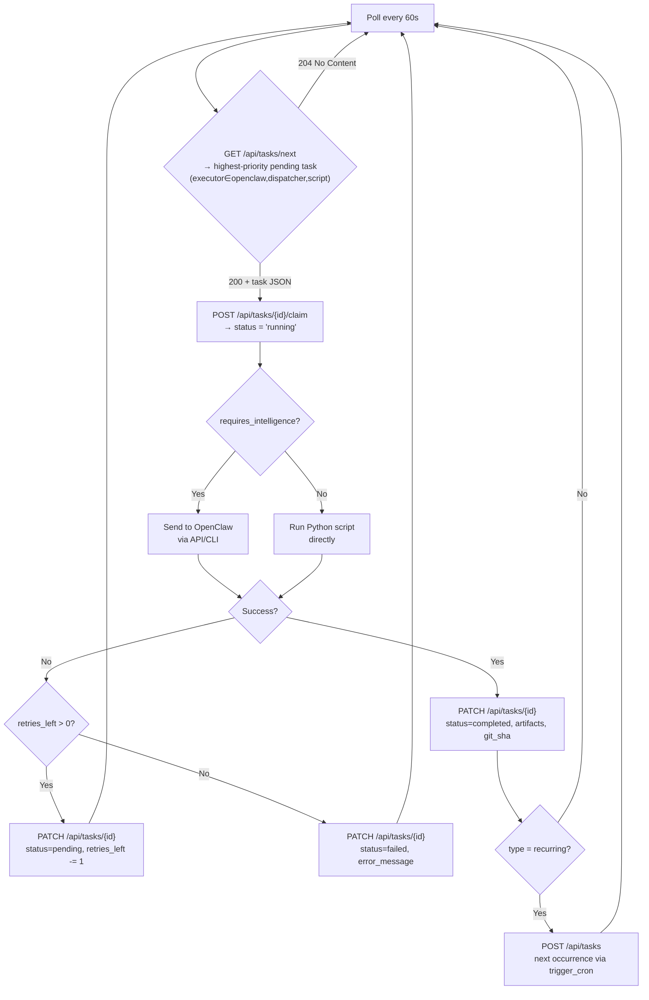
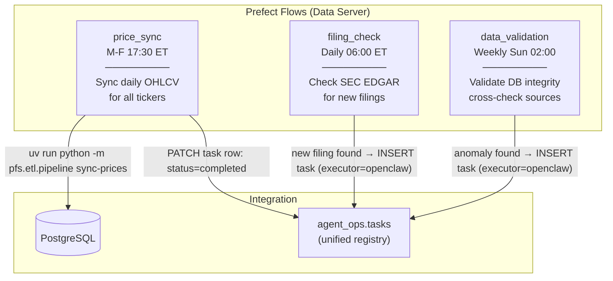
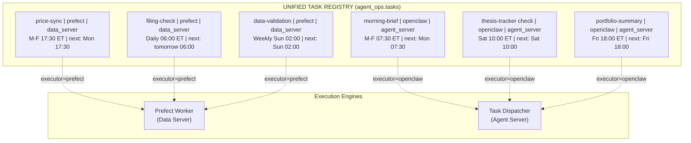
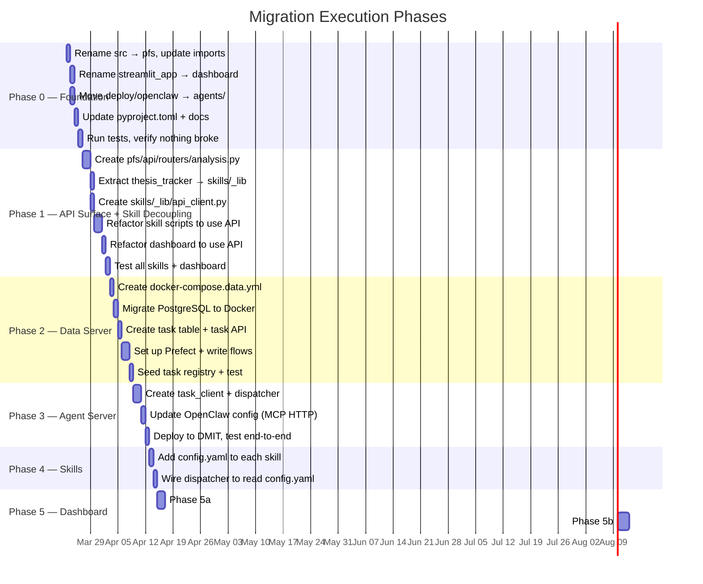

# Migration Plan: AI-Driven Hedge Fund Architecture

> **Version**: 1.3  
> **Date**: 2026-03-22  
> **Status**: Draft — awaiting approval before execution  
> **Changelog**: v1.3 — Prefect replaces Airflow, MCP HTTP replaces SSE, unified task registry (`executor` + `next_run_at` columns), centralized schedule view. v1.2 — Option B: MCP on Data Server, zero DB on Agent Server, task API + HTTP dispatcher. v1.1 — Refined skill-platform boundary (heavy/light split), added API surface design.

---

## 1. Vision

Build a one-person AI-powered hedge fund where AI agents replace human analysts. The system separates concerns across two servers, uses Prefect for mechanical scheduling, a centralized task registry for unified visibility, and produces git-tracked analysis artifacts.

---

## 2. Target Architecture

### 2.1 Two-Server Topology



### 2.2 Server Responsibilities

| Concern | Data Server (Mac) | Agent Server (DMIT) |
|---------|-------------------|---------------------|
| **PostgreSQL** | Docker container | — |
| **pgAdmin** | Docker container | — |
| **FastAPI** | Native (`uv run uvicorn :8000`) | — |
| **MCP Server** | Native (`uv run python -m pfs.mcp.server` HTTP :8001) | — |
| **ETL Pipeline** | Native (on-demand + Prefect) | — |
| **Prefect** | Native (`prefect server start` :4200) | — |
| **OpenClaw** | — | Installed (connects to MCP via HTTP over Tailscale) |
| **Streamlit** | — (dev only) | Service (calls REST API over Tailscale) |
| **Task Dispatcher** | — | Service (calls REST API over Tailscale) |
| **Artifacts Git** | — | Separate `.git` repo |
| **Skills Execution** | — | Via OpenClaw |

> **Hard rule**: The Agent Server has **zero** database dependencies. No `pfs.db.*`, no `sqlalchemy`, no `psycopg2`. All data access goes through REST API or MCP HTTP — both hosted on the Data Server.

### 2.3 Network



**Ports exposed (Tailscale only, never public):**

| Server | Port | Service | Access |
|--------|------|---------|--------|
| Data | 5432 | PostgreSQL | localhost only (internal to Data Server) |
| Data | 8000 | FastAPI REST | Agent Server + LAN |
| Data | 8001 | MCP Server (HTTP) | Agent Server only |
| Data | 4200 | Prefect UI | LAN only |
| Data | 5050 | pgAdmin | LAN only |
| Agent | 8501 | Streamlit | LAN only |
| Agent | 18789 | OpenClaw | localhost only |

> Note: PostgreSQL :5432 is **not exposed** on Tailscale — only FastAPI and MCP are. The Agent Server never connects to the DB directly.

---

## 3. Skill-Platform Boundary — Heavy/Light Split

### 3.1 The Problem

Skills run on the **Agent Server**. The `pfs/` package (DB, ETL, analysis) runs on the **Data Server**. Currently, skill scripts do `from src.analysis.xxx import ...` — direct Python imports that won't work across servers.

### 3.2 Design Principle

```
  HEAVY (DB queries, compute)          LIGHT (file I/O, text, simple math)
  ─────────────────────────            ───────────────────────────────────
  → Runs on DATA SERVER               → Runs on AGENT SERVER
  → Exposed as FastAPI endpoint        → Lives in skill scripts or skills/_lib/
  → Called via HTTP over Tailscale     → Direct Python imports
```

### 3.3 Function Classification



### 3.4 Complete Function-by-Function Table

#### `pfs/analysis/thesis_tracker.py` — ALL LIGHT (stays on Agent)

| Function | I/O | Classification | Reason |
|----------|-----|----------------|--------|
| `get_all_active_theses()` | Read JSON | **LIGHT** | Scans artifact dirs, no DB |
| `get_active_thesis(ticker)` | Read JSON | **LIGHT** | Single file read |
| `get_thesis_detail(ticker)` | Read 4 JSON | **LIGHT** | Merge local files |
| `get_catalysts(ticker)` | Read JSON | **LIGHT** | Single file read |
| `create_thesis(ticker, **kw)` | Write 4 JSON | **LIGHT** | Creates local files |
| `add_thesis_update()` | Write JSON | **LIGHT** | Append to local file |
| `add_health_check()` | Write JSON | **LIGHT** | Append to local file |
| `add_catalyst()` | Write JSON | **LIGHT** | Append to local file |
| `update_catalyst()` | Write JSON | **LIGHT** | Modify local file |
| `generate_thesis_markdown()` | Read 4 JSON | **LIGHT** | Formats text only |

**Action**: Extract into `skills/_lib/thesis_io.py` — no platform dependency.

#### `pfs/analysis/company_profile.py` — HEAVY (→ API)

| Function | I/O | Classification | Reason |
|----------|-----|----------------|--------|
| `get_profile_data(ticker, years)` | 6 DB table joins | **HEAVY** | Core data aggregation |
| `generate_tearsheet(ticker)` | DB + read JSON + format MD | **MIXED** | Split: API for data, local for format |

**Action**: New API endpoint `GET /api/analysis/profile/{ticker}?years=7` returns the profile data dict. Agent calls HTTP, formats locally.

#### `pfs/analysis/valuation.py` — HEAVY (→ API)

| Function | I/O | Classification | Reason |
|----------|-----|----------------|--------|
| `valuation_summary(ticker, **overrides)` | 4 DB queries + 25× DCF recalc | **HEAVY** | Compute-intensive |
| `_load_historical_data()` | 4 DB queries | **HEAVY** | Data loading |
| `_derive_assumptions()` | in-memory | LIGHT | Pure math |
| `_calc_wacc()` | yfinance call | MIXED | yfinance API access |
| `_build_sensitivity()` | 25× DCF | LIGHT (pure math) | No I/O |
| `_build_comps()` | JSON + yfinance | MIXED | External API access |
| `_get_current_price()` | yfinance | LIGHT | External API access |

**Action**: New API endpoint `GET /api/analysis/valuation/{ticker}` runs the full valuation pipeline on Data Server and returns JSON result. All yfinance/DB access stays on Data Server.

#### `pfs/analysis/investment_report.py` — HEAVY (→ API)

| Function | I/O | Classification | Reason |
|----------|-----|----------------|--------|
| `generate_investment_report()` | Calls `get_profile_data()` + `valuation_summary()` | **HEAVY** | Orchestrates DB queries |

**Action**: New API endpoint `GET /api/analysis/report/{ticker}` or combine with profile endpoint.

#### `skills/etl-coverage/check_coverage.py` — HEAVY (→ API)

| Function | I/O | Classification | Reason |
|----------|-----|----------------|--------|
| `analyze_company(ticker, db)` | 6 DB queries + SEC XBRL API + regex scan | **HEAVY** | DB + external API + compute |
| `print_company_report()` | stdout | LIGHT | Formatting |

**Action**: New API endpoint `GET /api/analysis/coverage/{ticker}`.

#### `skills/thesis-tracker/thesis_cli.py` — MIXED (needs splitting)

| Function | Current Imports | Classification | Action |
|----------|----------------|----------------|--------|
| `_regenerate_report()` | `generate_thesis_markdown()` | **LIGHT** | Keep — uses local JSON only |
| `_load_profile_seeds()` | none | **LIGHT** | Keep — reads local JSON |
| `_interactive_create()` | none | **LIGHT** | Keep — user input |
| `_interactive_update()` | `get_active_thesis()` | **LIGHT** | Keep — local JSON |
| `_compute_objective_score()` | `get_profile_data()` | **HEAVY** | **→ Call `/api/analysis/profile/` instead** |
| `_run_health_check()` | `get_profile_data()` + `add_health_check()` | **MIXED** | **→ Call API for data, keep scoring + file write local** |

#### `skills/company-profile/scripts/` — MIXED

| Script | Current Imports | Action |
|--------|----------------|--------|
| `build_comps.py` | yfinance directly | **→ Call `/api/analysis/comps/` instead** |
| `generate_report.py` | yfinance + JSON | **→ Call `/api/analysis/profile/` + `/api/analysis/valuation/`, format locally** |

### 3.5 New API Endpoints (Data Server)

```
pfs/api/routers/analysis.py  (NEW)

GET  /api/analysis/profile/{ticker}?years=7
     → Returns get_profile_data() dict
     → Used by: thesis_cli.py, generate_report.py, dashboard

GET  /api/analysis/valuation/{ticker}?revenue_growth=0.2&wacc=0.10&...
     → Returns valuation_summary() dict (DCF, sensitivity, scenarios, comps)
     → Used by: generate_report.py, dashboard

GET  /api/analysis/coverage/{ticker}
     → Returns analyze_company() dict
     → Used by: check_coverage.py, dashboard

GET  /api/analysis/comps/{ticker}
     → Returns peer data + summary statistics
     → Used by: build_comps.py, dashboard

GET  /api/analysis/current-price/{ticker}
     → Returns current price with caching (avoids yfinance rate limits)
     → Used by: thesis_cli.py, build_comps.py, generate_report.py
```

### 3.6 The Hard Rule

```
┌─────────────────────────────────────────────────────────────┐
│  AGENT SERVER — ZERO DATABASE DEPENDENCIES                   │
│                                                              │
│  ✅ MCP tools (agent ↔ MCP HTTP on Data Server)              │
│  ✅ REST API calls (skills/dashboard → FastAPI on Data Server│
│  ✅ Local file I/O (artifacts, JSON, markdown)               │
│                                                              │
│  ❌ import pfs.db.*          (no DB models/session)          │
│  ❌ import pfs.analysis.*    (heavy compute, has DB deps)    │
│  ❌ import pfs.etl.*         (ETL pipeline)                  │
│  ❌ import pfs.mcp.*         (MCP server runs on Data Server)│
│  ❌ import pfs.splits        (uses DB session)               │
│  ❌ import sqlalchemy        (no ORM on Agent Server)        │
│  ❌ import psycopg2          (no DB driver on Agent Server)  │
│                                                              │
│  NO EXCEPTIONS.                                              │
└─────────────────────────────────────────────────────────────┘

┌─────────────────────────────────────────────────────────────┐
│  DATA SERVER — ALL DB + COMPUTE + EXTERNAL API ACCESS        │
│                                                              │
│  PostgreSQL (Docker)                                         │
│  FastAPI :8000   — REST endpoints for skills + dashboard     │
│  MCP Server :8001 — HTTP transport for OpenClaw agent        │
│  Prefect          — mechanical scheduling (price, filings)   │
│  ETL pipeline     — ingestion + validation                   │
│  pfs/ package     — full platform code with all dependencies │
└─────────────────────────────────────────────────────────────┘
```

---

## 4. Code Reorganization

### 3.1 Directory Structure — Before vs After



### 4.2 Full Target Tree

```
personal-financial-skills/
├── pfs/                           # Python package (was src/)
│   ├── __init__.py
│   ├── config.py
│   ├── splits.py
│   ├── api/                       # FastAPI app + routers
│   │   ├── __init__.py
│   │   ├── app.py
│   │   └── routers/
│   │       ├── __init__.py
│   │       ├── companies.py
│   │       ├── etl.py
│   │       ├── filings.py
│   │       ├── financials.py
│   │       └── analysis.py        # NEW: heavy compute endpoints
│   ├── db/                        # SQLAlchemy models + session
│   │   ├── __init__.py
│   │   ├── models.py
│   │   ├── schema.sql
│   │   └── session.py
│   ├── etl/                       # ETL pipeline + clients
│   │   ├── __init__.py
│   │   ├── pipeline.py
│   │   ├── sec_client.py
│   │   ├── price_client.py
│   │   ├── xbrl_parser.py
│   │   ├── yfinance_client.py
│   │   ├── data_fallback.py
│   │   ├── section_extractor.py
│   │   └── validation.py
│   ├── mcp/                       # MCP server (HTTP transport, Data Server only)
│   │   ├── __init__.py
│   │   └── server.py              # transport="streamable-http", host on :8001
│   ├── analysis/                  # Heavy compute library (Data Server only)
│   │   ├── __init__.py
│   │   ├── company_profile.py     # get_profile_data() — 6 DB joins
│   │   ├── investment_report.py   # orchestrates profile + valuation
│   │   └── valuation.py           # DCF, sensitivity, comps — heavy math + DB
│   └── tasks/                     # Task queue system (Data Server only)
│       ├── __init__.py
│       ├── models.py              # AgentTask SQLAlchemy model
│       └── schema.sql             # Task table DDL
│
├── skills/                        # Agent skills (AGENT SERVER only)
│   ├── README.md
│   ├── _lib/                      # Shared skill utilities (no pfs.* imports!)
│   │   ├── __init__.py
│   │   ├── thesis_io.py           # Extracted from pfs/analysis/thesis_tracker.py
│   │   ├── artifact_io.py         # Read/write artifact files generically
│   │   ├── api_client.py          # HTTP client for Data Server REST API
│   │   ├── task_client.py         # HTTP client for task CRUD (/api/tasks/*)
│   │   └── mcp_helpers.py         # Common MCP call patterns
│   ├── company-profile/
│   │   ├── SKILL.md
│   │   ├── config.yaml            # Declarative triggers
│   │   ├── scripts/
│   │   │   ├── build_comps.py     # Calls /api/analysis/comps/ (no yfinance import)
│   │   │   └── generate_report.py # Calls /api/analysis/profile+valuation/, formats MD
│   │   └── references/
│   ├── thesis-tracker/
│   │   ├── SKILL.md
│   │   ├── config.yaml
│   │   ├── scripts/
│   │   │   └── thesis_cli.py      # Calls /api/analysis/profile/ for health checks
│   │   └── references/
│   ├── etl-coverage/
│   │   ├── SKILL.md
│   │   ├── config.yaml
│   │   ├── scripts/
│   │   │   └── check_coverage.py  # Calls /api/analysis/coverage/ (no DB import)
│   │   └── references/
│   └── (future skills...)
│
├── dashboard/                     # Streamlit app (was streamlit_app/)
│   ├── app.py
│   ├── pages/
│   │   ├── 1_company_profile.py
│   │   └── 2_thesis_tracker.py
│   └── components/
│       ├── __init__.py
│       ├── styles.py
│       ├── utils.py
│       ├── loaders/               # Calls /api/ or reads artifacts (no pfs.analysis.*)
│       │   ├── company.py
│       │   └── thesis.py
│       └── tabs/
│           ├── company_financials_tab.py
│           ├── company_overview_tab.py
│           ├── company_report_tab.py     # Calls /api/analysis/report/
│           ├── company_research_tab.py
│           ├── company_valuation_tab.py  # Calls /api/analysis/valuation/
│           ├── financials_tab.py
│           ├── thesis_health_tab.py
│           ├── thesis_summary_tab.py
│           └── thesis_updates_tab.py
│
├── agents/                        # Agent configurations
│   ├── openclaw/
│   │   ├── CLAUDE.md              # Production persona + commit-on-write rule
│   │   └── artifact-gitignore
│   ├── copilot/
│   │   └── README.md
│   └── prompts/
│       └── artifact-commit.md     # Shared commit-on-write instructions
│
├── prefect/                       # Prefect flows (Data Server only)
│   └── flows/
│       ├── price_sync.py
│       ├── filing_check.py
│       └── data_validation.py
│
├── data/
│   ├── raw/                       # SEC filings (Data Server)
│   ├── artifacts/                 # Agent output (Agent Server, separate .git)
│   └── reports/
│
├── deploy/
│   ├── docker/
│   │   └── docker-compose.data.yml    # PostgreSQL + pgAdmin only
│   ├── systemd/                       # Agent Server services only
│   │   ├── pfs-streamlit.service
│   │   └── pfs-task-dispatcher.service # Polls REST API, dispatches to OpenClaw
│   └── scripts/
│       ├── setup-data-server.sh
│       ├── setup-agent-server.sh
│       ├── deploy-data.sh
│       ├── deploy-agent.sh
│       └── setup-openclaw.sh
│
├── tests/
├── docs/
├── scripts/
├── pyproject.toml                 # packages = ["pfs"]
├── CLAUDE.md
├── .github/
│   ├── copilot-instructions.md
│   └── agents/
│       └── personal-finance-assistant.agent.md
└── .instructions.md
```

### 4.3 Key Structural Changes from v1.0

| Change | Why |
|--------|-----|
| `thesis_tracker.py` moves from `pfs/analysis/` → `skills/_lib/thesis_io.py` | Pure JSON I/O, no DB dependency — belongs on Agent Server |
| New `pfs/api/routers/analysis.py` | Exposes heavy compute as HTTP endpoints |
| New `pfs/api/routers/tasks.py` | Task CRUD for dispatcher (no direct DB from Agent Server) |
| MCP server moves to Data Server, HTTP transport on :8001 | Agent Server has zero DB dependencies |
| New `skills/_lib/api_client.py` | Skills call Data Server via HTTP, not Python imports |
| New `skills/_lib/task_client.py` | Dispatcher calls task API via HTTP |
| Task dispatcher is a pure HTTP client (no `pfs.*` imports) | Lives on Agent Server, polls `/api/tasks/next` |
| Dashboard loaders stop importing `pfs.*` entirely | Call API instead — dashboard also runs on Agent Server |
| `pfs/analysis/` shrinks to only DB-dependent code | `company_profile.py`, `valuation.py`, `investment_report.py` |

| Removed | Reason |
|---------|--------|
| `deploy/systemd/pfs-price-sync.*` | Replaced by Prefect flow |
| `deploy/systemd/pfs-filing-check.*` | Replaced by Prefect flow |
| `deploy/systemd/pfs-artifact-commit.*` | Replaced by commit-on-write |
| `deploy/systemd/pfs-api.service` | API runs on Data Server natively |
| `deploy/scripts/artifact-commit.sh` | Agent does commit-on-write |
| `deploy/scripts/check-new-filings.sh` | Replaced by Prefect flow |
| `deploy/scripts/setup-cron.sh` | OpenClaw cron setup moves to agent server setup |
| `docker-compose.yml` | Replaced by `deploy/docker/docker-compose.data.yml` |
| `Dockerfile` | Simplified — Docker is for DB only now |

---

## 5. Unified Task Registry

> **Design principle**: The `agent_ops.tasks` table is the **single source of truth** for ALL scheduled work in the system — mechanical (Prefect), intelligent (OpenClaw), event-driven, and user-requested. Execution engines vary; the catalog is centralized.

### 5.1 Why Unified?

Without centralization, tasks scatter across three places:
- Prefect flows (Data Server) — mechanical schedules hidden in Python code
- OpenClaw cron (Agent Server) — intelligent schedules hidden in crontab
- Task table — only event-driven / user tasks

**With the unified registry**, one API call shows everything:
```
GET /api/tasks/schedule → all recurring + scheduled tasks, regardless of executor
```

### 5.2 Task Lifecycle



### 5.3 Task Sources & Executors



### 5.4 Schema

```sql
-- On Data Server PostgreSQL, schema: agent_ops
CREATE SCHEMA IF NOT EXISTS agent_ops;

CREATE TABLE agent_ops.tasks (
    id              SERIAL PRIMARY KEY,
    
    -- What to do
    type            VARCHAR(20) NOT NULL        -- immediate | scheduled | recurring | event_triggered
                    CHECK (type IN ('immediate','scheduled','recurring','event_triggered')),
    skill           VARCHAR(50) NOT NULL,       -- company-profile, thesis-tracker, price-sync, etc.
    action          VARCHAR(50),                -- create, update, check, sync, etc.
    ticker          VARCHAR(10),                -- NULL for non-ticker tasks
    params          JSONB DEFAULT '{}',         -- extra parameters
    
    -- WHO runs this task (unified registry key field)
    executor        VARCHAR(20) NOT NULL        -- prefect | openclaw | dispatcher | script
                    DEFAULT 'dispatcher'
                    CHECK (executor IN ('prefect','openclaw','dispatcher','script')),
    
    -- Scheduling
    trigger_cron    VARCHAR(100),               -- cron expr for recurring
    trigger_event   VARCHAR(100),               -- event name for event_triggered
    scheduled_at    TIMESTAMPTZ,                -- when to execute (scheduled type)
    next_run_at     TIMESTAMPTZ,                -- next expected execution (for recurring)
    last_run_at     TIMESTAMPTZ,                -- last successful execution
    
    -- Lifecycle
    status          VARCHAR(20) DEFAULT 'pending'
                    CHECK (status IN ('pending','running','completed','failed','cancelled')),
    priority        INTEGER DEFAULT 5           -- 1=urgent, 5=normal, 9=background
                    CHECK (priority BETWEEN 1 AND 9),
    retries_left    INTEGER DEFAULT 2,
    
    -- Execution context
    server          VARCHAR(20),                -- data_server | agent_server (where it actually runs)
    requires_intelligence BOOLEAN DEFAULT TRUE, -- needs LLM reasoning?
    
    -- Audit
    created_by      VARCHAR(50) NOT NULL,       -- user | system | prefect | openclaw | telegram
    created_at      TIMESTAMPTZ DEFAULT NOW(),
    started_at      TIMESTAMPTZ,
    completed_at    TIMESTAMPTZ,
    
    -- Results
    result_summary  TEXT,
    error_message   TEXT,
    artifacts       JSONB DEFAULT '[]',         -- list of artifact paths written
    git_commit_sha  VARCHAR(40)                 -- commit hash from commit-on-write
);

-- For dispatcher polling (Agent Server tasks only)
CREATE INDEX idx_tasks_pending ON agent_ops.tasks(status, priority, created_at)
    WHERE status = 'pending' AND executor IN ('openclaw','dispatcher','script');
-- For Prefect flow matching
CREATE INDEX idx_tasks_prefect ON agent_ops.tasks(skill, status)
    WHERE executor = 'prefect' AND type = 'recurring';
-- General lookups
CREATE INDEX idx_tasks_ticker ON agent_ops.tasks(ticker);
CREATE INDEX idx_tasks_next_run ON agent_ops.tasks(next_run_at)
    WHERE type = 'recurring' AND status != 'cancelled';
```

### 5.5 Seed Script — Register All Recurring Tasks

On first deploy (or when schedules change), a seed script registers every recurring task:

```python
# scripts/seed_tasks.py — run once to populate the registry
RECURRING_TASKS = [
    # === DATA SERVER (executor=prefect) ===
    {"skill": "price-sync",       "action": "sync",     "trigger_cron": "30 21 * * 1-5",
     "executor": "prefect",       "server": "data_server",
     "requires_intelligence": False, "created_by": "system",
     "params": {"description": "Sync daily OHLCV for all tickers (M-F 17:30 ET)"}},
    
    {"skill": "filing-check",     "action": "check",    "trigger_cron": "0 10 * * *",
     "executor": "prefect",       "server": "data_server",
     "requires_intelligence": False, "created_by": "system",
     "params": {"description": "Check SEC EDGAR for new filings (daily 06:00 ET)"}},
    
    {"skill": "data-validation",  "action": "validate", "trigger_cron": "0 6 * * 0",
     "executor": "prefect",       "server": "data_server",
     "requires_intelligence": False, "created_by": "system",
     "params": {"description": "Validate DB integrity (weekly Sun 02:00 ET)"}},
    
    # === AGENT SERVER (executor=openclaw) ===
    {"skill": "morning-brief",    "action": "generate", "trigger_cron": "30 11 * * 1-5",
     "executor": "openclaw",      "server": "agent_server",
     "requires_intelligence": True, "created_by": "system",
     "params": {"description": "Morning market brief (M-F 07:30 ET)"}},
    
    {"skill": "thesis-tracker",   "action": "check --all", "trigger_cron": "0 14 * * 6",
     "executor": "openclaw",      "server": "agent_server",
     "requires_intelligence": True, "created_by": "system",
     "params": {"description": "Weekly thesis health check (Sat 10:00 ET)"}},
    
    {"skill": "portfolio-summary","action": "generate", "trigger_cron": "0 22 * * 5",
     "executor": "openclaw",      "server": "agent_server",
     "requires_intelligence": True, "created_by": "system",
     "params": {"description": "Weekly portfolio summary (Fri 18:00 ET)"}},
]
```

### 5.6 Example One-Off Tasks

> SQL shown for illustration. Agent Server sources use `POST /api/tasks/`.

```sql
-- User says via Telegram: "generate profile for NVDA"
INSERT INTO agent_ops.tasks (type, skill, action, ticker, executor, server, created_by)
VALUES ('immediate', 'company-profile', 'generate', 'NVDA', 'openclaw', 'agent_server', 'telegram');

-- User says: "In Q2 2026, watch MSFT FCF stop reducing"
INSERT INTO agent_ops.tasks (type, skill, action, ticker, params, scheduled_at, executor, server, created_by)
VALUES ('scheduled', 'thesis-tracker', 'check', 'MSFT',
        '{"focus": "free_cash_flow", "condition": "stop_reducing"}',
        '2026-04-01', 'openclaw', 'agent_server', 'telegram');

-- Prefect filing-check flow detects new 10-Q for AAPL
INSERT INTO agent_ops.tasks (type, skill, action, ticker, trigger_event, executor, server, created_by)
VALUES ('event_triggered', 'earnings-analysis', 'analyze', 'AAPL',
        'new_filing:10-Q', 'openclaw', 'agent_server', 'prefect');
```

### 5.7 Task API — Unified View

```python
# Key endpoints for visibility
@router.get("/api/tasks/schedule")
def get_schedule():
    """ALL recurring tasks across both servers — the unified view."""
    # Returns: [{skill, action, trigger_cron, executor, server, next_run_at, last_run_at, status}, ...]

@router.get("/api/tasks/")
def list_tasks(executor: str = None, server: str = None, status: str = None):
    """Filter tasks by executor, server, status. Dashboard uses this."""

@router.get("/api/tasks/stats")
def get_stats():
    """Summary: N pending, N running, N completed today, N failed. By executor breakdown."""
```

### 5.8 Task Dispatcher (Agent Server — HTTP only)

> The dispatcher runs on the Agent Server but has **zero** DB access.
> It reads and updates tasks exclusively through the REST API on the Data Server.
> It only picks up tasks where `executor IN ('openclaw', 'dispatcher', 'script')`.



---

## 6. Prefect (Data Server)

Prefect runs on the Data Server. It uses its built-in SQLite for internal metadata (no extra DB config needed), and connects to the application PostgreSQL for task registry updates.

### 6.1 Flow Overview



### 6.2 Flows

**`price_sync`** — Mechanical, no LLM needed

| Field | Value |
|-------|-------|
| Schedule | `30 21 * * 1-5` (UTC) = 17:30 ET M-F |
| Command | `uv run python -m pfs.etl.pipeline sync-prices` |
| Retries | 3 (5 min delay) |
| Timeout | 10 min |
| Registry | Updates `agent_ops.tasks` row (executor=prefect, skill=price-sync) |

**`filing_check`** — Mechanical, creates tasks for intelligent processing

| Field | Value |
|-------|-------|
| Schedule | `0 10 * * *` (UTC) = 06:00 ET daily |
| Steps | 1. Query DB for tracked tickers. 2. Check SEC EDGAR for new filings. 3. If new: download to `data/raw/`, INSERT task (executor=openclaw) into `agent_ops.tasks`. |
| Retries | 2 |
| Timeout | 5 min |

**`data_validation`** — Mechanical, flags anomalies

| Field | Value |
|-------|-------|
| Schedule | `0 6 * * 0` (UTC) = Sun 02:00 ET weekly |
| Steps | 1. Check for gaps in price data. 2. Cross-check revenue figures vs yfinance. 3. Flag mismatches → INSERT task (executor=openclaw) for agent review. |
| Retries | 1 |

Each flow wraps its work with registry updates:

```python
# prefect/flows/price_sync.py
from prefect import flow, task
from prefect.schedules import CronSchedule

@task
def update_registry(skill: str, status: str):
    """Update the unified task registry row for this flow."""
    # Direct DB: UPDATE agent_ops.tasks SET status=..., last_run_at=NOW()
    # WHERE skill=... AND executor='prefect' AND type='recurring'

@flow(name="price-sync", schedule=CronSchedule(cron="30 21 * * 1-5"))
def price_sync():
    update_registry("price-sync", "running")
    try:
        result = run_etl_sync()       # calls pfs.etl.pipeline
        update_registry("price-sync", "completed")
    except Exception as e:
        update_registry("price-sync", "failed")
        raise
```

### 6.3 Prefect Setup on Mac

```bash
# Install Prefect
uv add prefect

# Start Prefect server (UI on :4200)
prefect server start

# Register flows (in another terminal)
cd prefect/flows
prefect deploy --all

# Verify
prefect deployment ls
```

Prefect UI at `http://localhost:4200` — shows flow runs, logs, schedules. But the **canonical schedule view** is still `GET /api/tasks/schedule` from the unified registry.

---

## 7. Scheduling — Unified View

> **Key change from v1.2**: No more "check Prefect for mechanical, check OpenClaw cron for intelligent, check task table for events." Everything is visible in ONE place.

### 7.1 The Unified Schedule



### 7.2 How Each Engine Picks Up Work

| Engine | Runs On | Reads From | How |
|--------|---------|------------|-----|
| **Prefect** | Data Server | Own schedule (matches task registry) | Prefect's built-in cron scheduler triggers flows; flow updates registry row on start/complete/fail |
| **Task Dispatcher** | Agent Server | `GET /api/tasks/next` | Polls REST API every 60s for pending tasks with `executor IN (openclaw, dispatcher, script)` |
| **OpenClaw Cron** | Agent Server | Configured in OpenClaw via dispatcher | Dispatcher creates pending task rows at `next_run_at`; picks them up when due |

### 7.3 Decision Rule

| Question | → Route |
|----------|---------|
| Does it need LLM reasoning? | → `executor=openclaw` (Agent Server) |
| Is it a Python script with no judgment? | → `executor=prefect` (Data Server) |
| Is it triggered by an external event? | → `executor=openclaw` via task table |
| Does the user explicitly ask? | → `executor=openclaw` (immediate task) |

### 7.4 Dashboard Schedule View

```
GET /api/tasks/schedule

┌─────────────────────┬───────────┬──────────────┬──────────────┬──────────────┐
│ Skill               │ Executor  │ Server       │ Cron         │ Next Run     │
├─────────────────────┼───────────┼──────────────┼──────────────┼──────────────┤
│ price-sync          │ prefect   │ data_server  │ 30 21 * * 1-5│ Mon 17:30 ET │
│ filing-check        │ prefect   │ data_server  │ 0 10 * * *   │ Tomorrow 6:00│
│ data-validation     │ prefect   │ data_server  │ 0 6 * * 0    │ Sun 02:00 ET │
│ morning-brief       │ openclaw  │ agent_server │ 30 11 * * 1-5│ Mon 07:30 ET │
│ thesis-tracker check│ openclaw  │ agent_server │ 0 14 * * 6   │ Sat 10:00 ET │
│ portfolio-summary   │ openclaw  │ agent_server │ 0 22 * * 5   │ Fri 18:00 ET │
└─────────────────────┴───────────┴──────────────┴──────────────┴──────────────┘
```

---

## 8. Commit-on-Write (Agent System Prompt)

Added to the **agent persona** (`agents/openclaw/CLAUDE.md` and `.github/copilot-instructions.md`), NOT in individual SKILL.md files:

```markdown
## Artifact Version Control — MANDATORY

After writing ANY file(s) under `data/artifacts/`, you MUST immediately commit:

\```bash
cd {PROJECT_ROOT}/data/artifacts
git add -A
git commit -m "[{skill}] {TICKER}: {brief description of what changed}"
\```

Examples:
- `[company-profile] NVDA: generated profile v1`
- `[thesis-tracker] AAPL: Q1 2026 health check — score 72→68`
- `[thesis-tracker] MSFT: added catalyst — Azure AI revenue milestone`

If the commit fails (nothing to commit), that's fine — continue.
Do NOT push. Push is handled by a separate daily cron or manual trigger.
```

This means:
- Every analysis run = one git commit = one reviewable diff
- `git log --oneline data/artifacts/NVDA/thesis/` shows full history
- `git diff HEAD~1 -- data/artifacts/NVDA/thesis/health_checks.json` shows what changed
- `git revert <sha>` if agent writes garbage

---

## 9. Skill config.yaml

### 9.1 Schema

```yaml
# skills/{skill-name}/config.yaml
name: string                       # Skill identifier
version: string                    # Semver
description: string                # One-liner

triggers:                          # When this skill should run
  - event: string                  # Event name (new_filing, price_alert, etc.)
    filter: object                 # Event-specific filter criteria
    action: string                 # Skill subcommand to run
  - cron: string                   # Cron expression
    action: string

inputs:
  mcp_tools: [string]              # MCP tools this skill needs
  artifacts: [string]              # Artifact paths (may use {ticker} template)
  
outputs:
  path: string                     # Output directory template
  files: [string]                  # Expected output files

requires_intelligence: boolean     # true = needs LLM, false = pure Python
```

### 9.2 Examples

**company-profile/config.yaml**
```yaml
name: company-profile
version: "1.0"
description: "Generate 1-page company tearsheet with financials, comps, and report"

triggers:
  - event: new_filing
    filter: {form_type: ["10-K"]}
    action: generate
  - event: task_request
    action: generate

inputs:
  mcp_tools:
    - get_company
    - get_income_statements
    - get_balance_sheets
    - get_cash_flows
    - get_financial_metrics
    - get_prices
    - get_revenue_segments
  artifacts: []

outputs:
  path: "data/artifacts/{ticker}/profile/"
  files:
    - profile.json
    - comps.json
    - company_report.md

requires_intelligence: true
```

**thesis-tracker/config.yaml**
```yaml
name: thesis-tracker
version: "1.0"
description: "Create, update, and health-check investment theses"

triggers:
  - event: new_filing
    filter: {form_type: ["10-K", "10-Q"]}
    action: check
  - event: price_alert
    filter: {change_pct_abs: ">5"}
    action: check
  - cron: "0 10 * * 6"
    action: check --all

inputs:
  mcp_tools:
    - get_company
    - get_financial_metrics
    - get_income_statements
    - get_prices
  artifacts:
    - "{ticker}/profile/profile.json"

outputs:
  path: "data/artifacts/{ticker}/thesis/"
  files:
    - thesis.json
    - updates.json
    - health_checks.json
    - catalysts.json
    - thesis_report.md

requires_intelligence: true
```

**etl-coverage/config.yaml**
```yaml
name: etl-coverage
version: "1.0"
description: "Audit ETL data coverage and flag gaps"

triggers:
  - cron: "0 8 * * 1"
    action: check --all

inputs:
  mcp_tools:
    - list_companies
    - get_company
    - get_income_statements
    - get_balance_sheets
  artifacts: []

outputs:
  path: "data/artifacts/_etl/"
  files:
    - coverage_report.json

requires_intelligence: false
```

---

## 10. Execution Phases

### 10.1 Dependency Graph



### 10.2 Phase Details

---

#### Phase 0 — Foundation (Code Reorganization)

**Goal**: Rename packages, update all imports, verify tests pass. Pure mechanical refactor — no behavioral changes.

**Steps**:

| # | Action | Files Affected |
|---|--------|----------------|
| 0.1 | `git mv src/ pfs/` | Directory rename |
| 0.2 | Find-replace `from src.` → `from pfs.` in all `.py` files | 35 Python files (~94 import lines) |
| 0.3 | Find-replace `-m src.` → `-m pfs.` in all `.md`, `.sh` files | 13 doc/script files (~35 lines) |
| 0.4 | `git mv streamlit_app/ dashboard/` | Directory rename |
| 0.5 | Update Streamlit command in docs/deploy scripts | deploy scripts, CLAUDE.md |
| 0.6 | `mkdir -p agents/openclaw agents/copilot agents/prompts` | New directories |
| 0.7 | `git mv deploy/openclaw/CLAUDE.md agents/openclaw/` | Move agent config |
| 0.8 | `git mv deploy/openclaw/artifact-gitignore agents/openclaw/` | Move agent config |
| 0.9 | Update `pyproject.toml`: `packages = ["pfs"]` | 1 file |
| 0.10 | Create `agents/prompts/artifact-commit.md` | Commit-on-write prompt |
| 0.11 | Update CLAUDE.md, copilot-instructions.md, .instructions.md | 3 files |
| 0.12 | `uv sync` and `pytest` | Verify nothing broke |

**Risk**: Import breakage. Mitigated by running full test suite after step 0.2.

**Rollback**: `git reset --hard HEAD~1` (single commit for all renames).

---

#### Phase 1 — API Surface + Skill Decoupling

**Goal**: Create the heavy-compute API endpoints, extract light code to skills, make skills call API instead of importing platform modules. This is the critical architectural change.

**Step 1.1 — Create `pfs/api/routers/analysis.py`**

New FastAPI router exposing heavy compute:

```python
# pfs/api/routers/analysis.py
from fastapi import APIRouter, Query
router = APIRouter(prefix="/api/analysis", tags=["analysis"])

@router.get("/profile/{ticker}")
def get_profile(ticker: str, years: int = Query(7)):
    """Heavy: 6 DB table joins → materialized profile data."""
    from pfs.analysis.company_profile import get_profile_data
    return get_profile_data(ticker, years)

@router.get("/valuation/{ticker}")
def get_valuation(ticker: str, revenue_growth: float = None, wacc: float = None):
    """Heavy: DB load + 25-cell sensitivity + 3 scenarios."""
    from pfs.analysis.valuation import valuation_summary
    overrides = {}
    if revenue_growth is not None: overrides["revenue_growth"] = revenue_growth
    if wacc is not None: overrides["wacc"] = wacc
    return valuation_summary(ticker, **overrides)

@router.get("/coverage/{ticker}")
def get_coverage(ticker: str):
    """Heavy: 6 DB queries + XBRL heuristic scan."""
    # Moved from skills/etl-coverage/scripts/check_coverage.py
    ...

@router.get("/comps/{ticker}")
def get_comps(ticker: str):
    """Heavy: yfinance peer data + statistical aggregation."""
    ...

@router.get("/current-price/{ticker}")
def get_current_price(ticker: str):
    """Light but needs yfinance — cache on Data Server."""
    ...
```

Register in `pfs/api/app.py`:
```python
from pfs.api.routers import companies, etl, filings, financials, analysis, tasks
app.include_router(analysis.router)
app.include_router(tasks.router)
```

**Step 1.1b — Create `pfs/api/routers/tasks.py`**

Task CRUD for the dispatcher (Agent Server) to call over HTTP:

```python
# pfs/api/routers/tasks.py
from fastapi import APIRouter, HTTPException
from pfs.db.session import get_session
from pfs.tasks.models import Task
router = APIRouter(prefix="/api/tasks", tags=["tasks"])

@router.get("/next")
def next_task():
    """Return highest-priority pending task, or 204."""
    with get_session() as s:
        task = s.query(Task).filter(
            Task.status == "pending",
            Task.scheduled_at <= func.now()
        ).order_by(Task.priority, Task.created_at).first()
    if not task:
        return Response(status_code=204)
    return task.to_dict()

@router.post("/{task_id}/claim")
def claim_task(task_id: int):
    """Atomically SET status = 'running'. Returns 409 if already claimed."""
    ...

@router.patch("/{task_id}")
def update_task(task_id: int, body: TaskUpdate):
    """Update status, result_summary, error_message, artifacts, git_commit_sha."""
    ...

@router.post("/")
def create_task(body: TaskCreate):
    """Insert a new task. Used by: Prefect flows, dispatcher (recurring), user."""
    ...

@router.get("/")
def list_tasks(status: str = None, ticker: str = None, limit: int = 50):
    """List tasks with optional filters. Used by: dashboard, admin."""
    ...
```

**Step 1.2 — Extract `thesis_tracker.py` → `skills/_lib/thesis_io.py`**

All functions are pure JSON I/O. Move them out of `pfs/analysis/` into `skills/_lib/`:

```
pfs/analysis/thesis_tracker.py  →  skills/_lib/thesis_io.py
```

Update imports in:
- `skills/thesis-tracker/scripts/thesis_cli.py`: `from skills._lib.thesis_io import ...`
- `dashboard/pages/2_thesis_tracker.py`: `from skills._lib.thesis_io import ...`
- `dashboard/components/loaders/thesis.py`: same

**Step 1.3 — Create `skills/_lib/api_client.py`**

Thin HTTP client for skills to call Data Server:

```python
# skills/_lib/api_client.py
import httpx
import os

API_BASE = os.environ.get("PFS_API_URL", "http://127.0.0.1:8000")

def get_profile(ticker: str, years: int = 7) -> dict:
    r = httpx.get(f"{API_BASE}/api/analysis/profile/{ticker}", params={"years": years})
    r.raise_for_status()
    return r.json()

def get_valuation(ticker: str, **overrides) -> dict:
    r = httpx.get(f"{API_BASE}/api/analysis/valuation/{ticker}", params=overrides)
    r.raise_for_status()
    return r.json()

def get_current_price(ticker: str) -> dict:
    r = httpx.get(f"{API_BASE}/api/analysis/current-price/{ticker}")
    r.raise_for_status()
    return r.json()

def get_coverage(ticker: str) -> dict:
    r = httpx.get(f"{API_BASE}/api/analysis/coverage/{ticker}")
    r.raise_for_status()
    return r.json()
```

**Step 1.4 — Refactor skill scripts**

Replace platform imports with API calls:

| File | Before | After |
|------|--------|-------|
| `thesis_cli.py` | `from pfs.analysis.company_profile import get_profile_data` | `from skills._lib.api_client import get_profile` |
| `thesis_cli.py` | `from pfs.analysis.thesis_tracker import ...` | `from skills._lib.thesis_io import ...` |
| `build_comps.py` | `import yfinance` | `from skills._lib.api_client import get_comps` |
| `generate_report.py` | `import yfinance` + JSON load | `from skills._lib.api_client import get_profile, get_valuation` |
| `check_coverage.py` | `from pfs.db.session ...` + `from pfs.etl ...` | `from skills._lib.api_client import get_coverage` |

**Step 1.5 — Refactor dashboard**

Same pattern — dashboard components call API instead of importing `pfs.analysis.*`:

| File | Before | After |
|------|--------|-------|
| `dashboard/components/loaders/company.py` | `from pfs.splits import ...` | via API or keep (if running on same server in dev) |
| `dashboard/components/tabs/company_report_tab.py` | `from pfs.analysis.company_profile import ...` | HTTP call to `/api/analysis/profile/` |
| `dashboard/components/tabs/company_valuation_tab.py` | `from pfs.analysis.valuation import ...` | HTTP call to `/api/analysis/valuation/` |
| `dashboard/pages/2_thesis_tracker.py` | `from pfs.analysis.thesis_tracker import ...` | `from skills._lib.thesis_io import ...` |

**Step 1.6 — Test**

Run all skill scripts + dashboard against local FastAPI. All `from pfs.analysis.*` imports should be gone from skills/ and dashboard/.

```bash
# Verify no direct pfs.analysis imports remain in skills/ or dashboard/
grep -r "from pfs.analysis" skills/ dashboard/
# Should return ZERO results

# Run tests
uv run pytest
```

---

#### Phase 2 — Data Server Setup

**Goal**: PostgreSQL + pgAdmin in Docker on Mac, task system + unified registry, MCP HTTP, Prefect scheduling.

**Steps**:

| # | Action | Notes |
|---|--------|-------|
| 2.1 | Create `deploy/docker/docker-compose.data.yml` | PostgreSQL 16 + pgAdmin only |
| 2.2 | Add `.env.data-server` template | DB credentials, Tailscale bind address |
| 2.3 | Test: `docker compose up -d` → `psql` connection works | |
| 2.4 | Migrate existing PostgreSQL data (if any) via `pg_dump` / `pg_restore` | |
| 2.5 | Test: `uv run uvicorn pfs.api.app:app` connects to Docker PostgreSQL | |
| 2.6 | Run `agent_ops` schema DDL from Section 5.4 | Creates `agent_ops.tasks` table (with `executor`, `next_run_at` columns) |
| 2.7 | Create `pfs/tasks/models.py` — SQLAlchemy model for `agent_ops.tasks` | Data Server only |
| 2.8 | Create `pfs/api/routers/tasks.py` — task CRUD + `/schedule` + `/stats` | Unified view endpoints |
| 2.9 | Test task API: `curl localhost:8000/api/tasks/schedule` | Verify unified view works |
| 2.10 | Update MCP server: `transport="streamable-http"`, bind to `:8001` | `pfs/mcp/server.py` |
| 2.11 | Test MCP HTTP: `curl -X POST http://localhost:8001/mcp` | Verify HTTP transport |
| 2.12 | Install Prefect: `uv add prefect` | |
| 2.13 | Write `prefect/flows/price_sync.py` | Updates task registry row on start/complete/fail |
| 2.14 | Write `prefect/flows/filing_check.py` | Check SEC, INSERT task (executor=openclaw) |
| 2.15 | Write `prefect/flows/data_validation.py` | Integrity checks, INSERT task if anomaly |
| 2.16 | Run `scripts/seed_tasks.py` | Register ALL recurring tasks in unified registry |
| 2.17 | Test: `prefect deployment run price-sync` | Verify flow runs + registry updates |
| 2.18 | Test: `curl localhost:8000/api/tasks/schedule` | Verify all 6 recurring tasks visible |

**docker-compose.data.yml preview**:
```yaml
services:
  postgres:
    image: postgres:16
    environment:
      POSTGRES_USER: pfs
      POSTGRES_PASSWORD: ${PFS_DB_PASSWORD}
      POSTGRES_DB: personal_finance
    ports:
      - "${TAILSCALE_IP:-127.0.0.1}:5432:5432"
    volumes:
      - pgdata:/var/lib/postgresql/data
      - ./../../pfs/db/schema.sql:/docker-entrypoint-initdb.d/01-schema.sql
    restart: unless-stopped

  pgadmin:
    image: dpage/pgadmin4
    environment:
      PGADMIN_DEFAULT_EMAIL: ${PGADMIN_EMAIL:-admin@local.dev}
      PGADMIN_DEFAULT_PASSWORD: ${PGADMIN_PASSWORD:-admin}
    ports:
      - "${TAILSCALE_IP:-127.0.0.1}:5050:80"
    restart: unless-stopped

volumes:
  pgdata:
```

---

#### Phase 3 — Agent Server Setup

**Goal**: Task dispatcher service, updated OpenClaw config, artifact git repo. Zero DB dependencies — dispatcher calls REST API only.

**Steps**:

| # | Action | Notes |
|---|--------|-------|
| 3.1 | Add `agent_ops` schema + `tasks` table to PostgreSQL (**Data Server**) | Run DDL from Section 5.4 |
| 3.2 | Create `pfs/tasks/models.py` — SQLAlchemy model (**Data Server** only) | Used by `pfs/api/routers/tasks.py` |
| 3.3 | Test Task API: `curl http://100.124.x.x:8000/api/tasks/next` | Verify CRUD works over Tailscale |
| 3.4 | Create `skills/_lib/task_client.py` — HTTP client for task API | Used by dispatcher on Agent Server |
| 3.5 | Create `agents/task_dispatcher.py` — poll loop using `task_client` | Pure HTTP, no `pfs.db.*` imports |
| 3.6 | Create `deploy/systemd/pfs-task-dispatcher.service` | Runs on Agent Server |
| 3.7 | Update `agents/openclaw/CLAUDE.md` with commit-on-write rules + MCP HTTP URL | |
| 3.8 | Update `deploy/scripts/setup-openclaw.sh` for new paths + MCP HTTP config | |
| 3.9 | Create `deploy/scripts/setup-agent-server.sh` | |
| 3.10 | Create `deploy/scripts/setup-data-server.sh` | |
| 3.11 | Deploy to DMIT, run end-to-end test | Telegram → OpenClaw → skill → API → artifact commit |

**Dispatcher code preview** (`agents/task_dispatcher.py`):

```python
# agents/task_dispatcher.py — runs on Agent Server
# NO pfs.db.*, NO sqlalchemy, NO psycopg2
import time, subprocess, os
from skills._lib.task_client import TaskClient

client = TaskClient(base_url=os.environ["PFS_API_URL"])  # http://100.124.x.x:8000

def main():
    while True:
        task = client.next_task()
        if not task:
            time.sleep(60)
            continue
        
        client.claim_task(task["id"])
        try:
            if task.get("requires_intelligence", True):
                # Send to OpenClaw via CLI
                result = subprocess.run(
                    ["openclaw", "run", "--prompt", build_prompt(task)],
                    capture_output=True, text=True, timeout=300
                )
            else:
                # Run Python script directly
                result = subprocess.run(
                    ["uv", "run", "python", resolve_script(task)],
                    capture_output=True, text=True, timeout=300
                )
            
            client.complete_task(task["id"], artifacts=parse_artifacts(result))
        except Exception as e:
            client.fail_task(task["id"], error=str(e))

if __name__ == "__main__":
    main()
```

**Task client** (`skills/_lib/task_client.py`):

```python
# skills/_lib/task_client.py — thin HTTP wrapper
import httpx

class TaskClient:
    def __init__(self, base_url: str):
        self.base = base_url.rstrip("/")
    
    def next_task(self) -> dict | None:
        r = httpx.get(f"{self.base}/api/tasks/next")
        return r.json() if r.status_code == 200 else None
    
    def claim_task(self, task_id: int):
        httpx.post(f"{self.base}/api/tasks/{task_id}/claim").raise_for_status()
    
    def complete_task(self, task_id: int, **kwargs):
        httpx.patch(f"{self.base}/api/tasks/{task_id}", json={"status": "completed", **kwargs}).raise_for_status()
    
    def fail_task(self, task_id: int, error: str):
        httpx.patch(f"{self.base}/api/tasks/{task_id}", json={"status": "failed", "error_message": error}).raise_for_status()
    
    def create_task(self, **kwargs):
        httpx.post(f"{self.base}/api/tasks/", json=kwargs).raise_for_status()
```

---

#### Phase 4 — Skill Declarative Config

**Goal**: Add config.yaml to each skill, wire dispatcher to read it.

| # | Action |
|---|--------|
| 4.1 | Add `config.yaml` to company-profile, thesis-tracker, etl-coverage |
| 4.2 | Create `skills/_lib/artifact_io.py` — generic read/write helpers |
| 4.3 | Create `skills/_lib/mcp_helpers.py` — common MCP call patterns |
| 4.4 | Update dispatcher to read `config.yaml` for routing decisions |
| 4.5 | Test: Prefect filing-check → task table → dispatcher → OpenClaw → skill → artifact commit |

---

#### Phase 5 — Dashboard Evolution

**Phase 5a: Artifact Editing** (read → edit)
- Add Streamlit forms for editing thesis text, catalyst notes
- Write to `data/artifacts/` (text files only, never PostgreSQL)
- Trigger artifact commit after save

**Phase 5b: Chatbot Widget** (edit → chat)
- Add Streamlit chat widget connected to OpenClaw API
- User types: "update NVDA thesis with Q4 beat" → OpenClaw runs skill → dashboard reloads

---

## 11. Import Change Inventory

Complete list of files requiring `src.` → `pfs.` changes:

### Python Files (35 files, ~94 import lines)

| File | Import Lines |
|------|-------------|
| `check_data.py` | 2 |
| `pfs/splits.py` | 3 |
| `pfs/config.py` | 0 (no internal imports) |
| `pfs/api/app.py` | 1 |
| `pfs/api/routers/companies.py` | 2 |
| `pfs/api/routers/filings.py` | 4 |
| `pfs/api/routers/financials.py` | 2 |
| `pfs/api/routers/etl.py` | 4 |
| `pfs/db/session.py` | 1 |
| `pfs/mcp/server.py` | 5 |
| `pfs/etl/section_extractor.py` | 1 |
| `pfs/etl/sec_client.py` | 1 |
| `pfs/etl/price_client.py` | 3 |
| `pfs/etl/pipeline.py` | 8 |
| `pfs/etl/data_fallback.py` | 1 |
| `pfs/analysis/company_profile.py` | 2 |
| `pfs/analysis/investment_report.py` | 3 |
| `pfs/analysis/valuation.py` | 4 |
| `skills/etl-coverage/scripts/check_coverage.py` | 4 |
| `skills/thesis-tracker/scripts/thesis_cli.py` | 9 |
| `skills/company-profile/scripts/build_comps.py` | ? (needs check) |
| `skills/company-profile/scripts/generate_report.py` | ? (needs check) |
| `dashboard/pages/2_thesis_tracker.py` | 2 |
| `dashboard/components/loaders/thesis.py` | 1 |
| `dashboard/components/loaders/company.py` | 3 |
| `dashboard/components/tabs/company_report_tab.py` | 2 |
| `dashboard/components/tabs/company_valuation_tab.py` | 1 |
| `tests/test_api.py` | 4 |
| `tests/test_data_fallback.py` | 1 |
| `tests/test_pipeline.py` | 4 |
| `tests/test_price_client.py` | 1 |
| `tests/test_splits_db.py` | 2 |
| `tests/test_xbrl_parser.py` | 2 |

### Documentation / Config Files (14 files, ~35 lines)

| File | Pattern |
|------|---------|
| `CLAUDE.md` | `src.etl`, `src.mcp` references |
| `README.md` | CLI command references |
| `.instructions.md` | Module references |
| `.github/copilot-instructions.md` | Module + CLI references |
| `.github/agents/personal-finance-assistant.agent.md` | Module references |
| `docs/quickstart.md` | CLI command references |
| `docs/architecture.md` | Module references |
| `skills/company-profile/SKILL.md` | CLI references |
| `skills/etl-coverage/SKILL.md` | CLI reference |
| `skills/etl-coverage/references/troubleshooting.md` | Module references |
| `skills/thesis-tracker/SKILL.md` | CLI reference |
| `deploy/README.md` | Module reference |
| `agents/openclaw/CLAUDE.md` | Module + CLI references |
| `deploy/scripts/*.sh` | CLI + inline Python references |

---

## 12. Risk Assessment

| Risk | Impact | Mitigation |
|------|--------|------------|
| Import rename breaks something | High | Full test suite after Phase 0; single commit for all renames |
| Skill decoupling misses a hidden DB dependency | High | `grep -r "from pfs.analysis" skills/ dashboard/` must return 0 after Phase 1 |
| API latency for skill scripts (HTTP vs direct import) | Low | Tailscale adds <5ms; FastAPI overhead ~1ms; DB queries dominate |
| MCP HTTP transport compatibility | Low | FastMCP supports `streamable-http` natively since v1.x; standard HTTP — no WebSocket/SSE complexity |
| Prefect server overhead on Mac | Low | Prefect server is lightweight (~200MB RAM); uses built-in SQLite for metadata |
| Task registry out of sync with Prefect schedules | Medium | Prefect flows update registry rows on every run; `seed_tasks.py` re-syncs on deploy |
| Task dispatcher OOM on 2GB DMIT | Medium | Lightweight poll loop; actual work done by OpenClaw subprocess |
| `skills/_lib/` import path needs PYTHONPATH setup | Medium | Add `skills/` to `sys.path` in each skill script, or use relative imports |
| OpenClaw API availability for chatbot | Medium | Verify OpenClaw exposes HTTP API; fallback to CLI invocation |
| Data Server (Mac) offline → Agent Server blind | High | Agent can still read local artifacts; tasks queue until reconnect. Add alerting for API unreachable. |

---

## 13. Checklist — Ready to Execute?

- [ ] User approves Phase 0 (rename `src/` → `pfs/`, `streamlit_app/` → `dashboard/`)
- [ ] User approves Phase 1 (API surface + skill decoupling)
- [ ] User approves Phase 2 (Docker PostgreSQL, task registry, Prefect, MCP HTTP)
- [ ] User approves Phase 3 (task dispatcher, OpenClaw config on Agent Server)
- [ ] User approves Phase 4 (config.yaml on skills)
- [ ] User approves Phase 5 plan (phased dashboard evolution)
- [ ] User confirms DMIT server access for Phase 3 deployment
- [ ] User confirms Tailscale IPs for cross-server config
