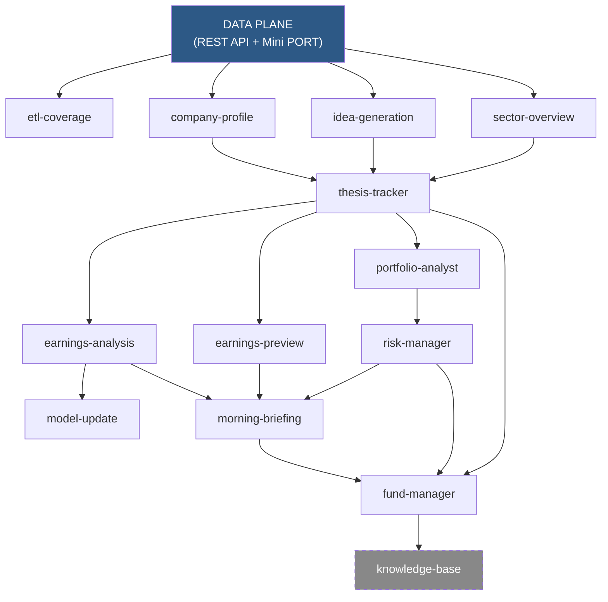

# Skills Directory

Agent-readable skill definitions for the Mini Bloomberg personal investor toolkit.

## Skill Structure

Each skill is a **self-contained directory**:

```
<skill>/
  SKILL.md          # Agent instructions — read this first
  config.yaml       # Triggers, API endpoints, artifact paths
  scripts/          # Thin CLI scripts (call API → AI analysis → write artifacts)
  references/       # Prompt templates, formulas, data source guides
```

No shared `_lib/`. Each skill owns its scripts. Heavy computation lives in the FastAPI server.

## Available Skills

| Skill | Purpose | Output Path | Status |
|-------|---------|-------------|--------|
| `company-profile/` | Company tearsheet (10-K parsing, comps, report) | `data/artifacts/{ticker}/profile/` | ✅ Production |
| `thesis-tracker/` | Investment thesis CRUD + health checks | `data/artifacts/{ticker}/thesis/` | ✅ Production |
| `etl-coverage/` | Data quality audit across ingested tickers | `data/artifacts/_etl/` | ✅ Production |
| `portfolio-analyst/` | AI portfolio review + rebalancing recommendations | `data/artifacts/_portfolio/analysis/` | ✅ Production |
| `earnings-analysis/` | Post-earnings analysis with thesis impact | `data/artifacts/{ticker}/earnings/` | ✅ Production |
| `earnings-preview/` | Pre-earnings scenario framework | `data/artifacts/{ticker}/earnings/` | ✅ Production |
| `risk-manager/` | Portfolio-level risk monitoring + alerts | `data/artifacts/_portfolio/risk/` | ✅ Production |
| `morning-briefing/` | Daily research digest | `data/artifacts/_daily/briefings/` | ✅ Production |
| `model-update/` | Financial projection maintenance | `data/artifacts/{ticker}/model/` | ✅ Production |
| `idea-generation/` | Stock screening pipeline | `data/artifacts/_ideas/` | ✅ Production |
| `sector-overview/` | Industry landscape reports | `data/artifacts/_sectors/{sector}/` | ✅ Production |
| `catalyst-calendar/` | Cross-portfolio event calendar | `data/artifacts/_portfolio/catalysts/` | ✅ Production |
| `fund-manager/` | Multi-agent decision synthesis | `data/artifacts/_portfolio/decisions/` | ✅ Production |
| `knowledge-base/` | External research ingestion | `data/artifacts/_knowledge/` | 🏗️ Placeholder |

## Invoking a Skill

An agent reads `SKILL.md` and follows its workflow:

```
Agent: "I need to create a company profile for NVDA"
→ Reads skills/company-profile/SKILL.md
→ Checks prerequisite: GET /api/companies/NVDA returns 200?
→ If 404, tells user to run ETL first
→ Follows Task 1 → Task 2 → Task 3
→ Artifacts saved to data/artifacts/NVDA/profile/
```

## Architecture Rules

1. **Self-contained** — Each skill's scripts live in `<skill>/scripts/`. No cross-skill imports.
2. **Read-only API access** — Skills read via REST API (`$PFS_API_URL`). Never write to DB directly.
3. **Skills read artifacts, never call each other** — If earnings-analysis needs thesis data, it reads `thesis.json`.
4. **Heavy work → FastAPI server** — DB queries, risk math, screening → server endpoints. Scripts stay thin.
5. **JSON + Markdown output** — Structured data as JSON (`"schema_version": "1.0"`), narrative as Markdown.
6. **Append-only history** — Updates, health checks, decisions: always append, never overwrite.
7. **CLI mirrors agent** — Everything the agent can do, a human can do via CLI.
8. **References for prompts** — AI prompts live in `references/`, not hardcoded in scripts.
9. **Persist to DB** — Call `POST /api/analysis/reports` after writing artifacts.

## Data Source Priority

```
REST API (database) → local SEC files → Alpha Vantage → yfinance → web search
```

## Dependency Graph



> Skills read from REST API and other skill artifacts. No skill invokes another directly.
